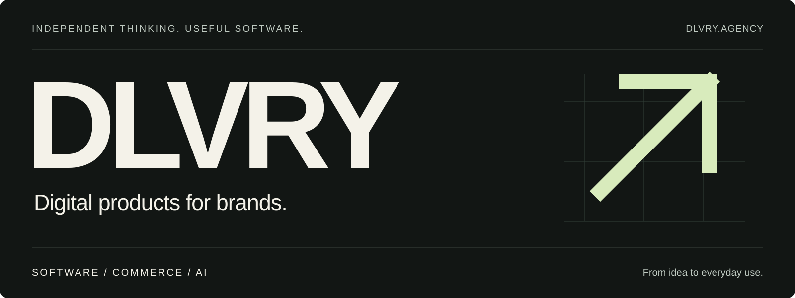

 

We build software that connects **marketing, commerce and everyday operations**. Our focus is on digital products that are useful to the people behind a brand: connected tools, clearer workflows and less repetitive work.

 

| **01 — Digital products** | **02 — Connected commerce** | **03 — AI & automation** |
| :--- | :--- | :--- |
| Applications shaped around how brands and teams work. | Integrations that bring storefronts, catalogs and business tools together. | Workflows that help teams prepare content and simplify routine tasks. |

 

### Built with purpose. Made to be used.

We start with the work people need to do, connect the systems around it and build the product that brings it together.

This is the home of DLVRY's engineering work. Explore our public repositories for project documentation, setup instructions and development status.

 

---

### Have something in mind?

Let's talk about what you're building.

**[Explore DLVRY ↗](https://www.dlvry.agency/)** &nbsp;&nbsp;·&nbsp;&nbsp; **[dev@dlvry.agency](mailto:dev@dlvry.agency)**
